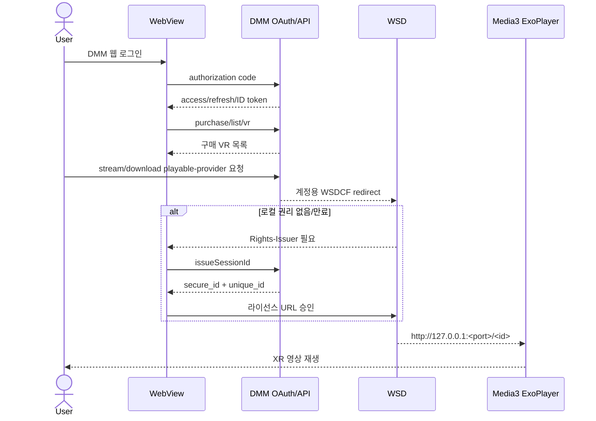

# XR Stream App DMM/WSD 이식 보고서

> 분석·구현일: 2026-08-30
> 보고서 형식: 일반 APK 역분석(`flavor = null`)
> 검증 수준: 정적 분석 및 파일 프로비저닝 검증. Android 빌드와 실제 DMM 서버 호출은 프로젝트 정책과 `lab_only` 범위 때문에 수행하지 않음.

## 실행 요약

DMM VR Player의 인증, Digital API, WSD 호출 경계를 분석해 Jetpack XR 앱의 기존 Media3 플레이어에 연결했다. 구현은 웹 로그인에서 OAuth code를 받고 토큰과 SessionID를 발급하며, `/purchase/list/vr`로 구매 목록을 불러온다. 구매 카드의 스트림·다운로드 동작은 각각 `/playableprovider/stream/vr`, `/playableprovider/download/vr`을 호출하고, 원 앱과 같은 헤더 및 HMAC-SHA256 입력 순서로 계정용 WSDCF redirect를 발급한다. 스트림 URL은 `redirect + &licenseUID=<cookie_info.value>&smartphone_access=1`, 다운로드 URL은 `redirect + ?uid=<cookie_info.value>`로 조립한다. 이후 `secid`/`dmm_app_uid` 쿠키로 WSD Rights-Issuer 흐름을 진행하고, 권리가 확인되면 원 WSD 런타임의 loopback URI를 `PlaybackSource.Direct`로 기존 ExoPlayer에 전달한다. DMM이 신규 앱의 OAuth client·Digital API client·redirect·package를 실제 허용하는지는 기기에서 확인해야 한다. DRM 또는 구매 권한을 우회하는 로직은 포함하지 않았다.

## 범위와 제약

- 범위 계약: [scope.md](../../reverse-skill/work/xr-stream-app-dmm-port/scope.md)
- 입력: 사용자가 제공한 `base.apk`, `split_config.arm64_v8a.apk`, 공개 테스트 WSDCF, `xr-stream-app`
- 네트워크 프로필: `lab_only`
- 제외: 실계정 로그인, 운영 API 호출, 라이선스 서버 동적 검증, Android 빌드/설치
- 샘플 SHA-256:
  - base APK: `d5f859d036db30de517ef5153772bdcd6ed2ebc5f048b26f535aa233d5a4fb42`
  - ARM64 split: `6672d1f1af30f3ff129f187efc45e19e7209dc06005248e42b19074d017d59a3`

## 구현 결과

| 영역 | 구현 위치 | 결과 |
|---|---|---|
| OAuth code/token 및 JWT 검증 | `app/src/main/java/blackark/app/vr/dmm/DmmAuthClient.kt` | `/connect/v1/token`, HS512 ID-token 검증, refresh 처리 |
| SessionID/쿠키 | `DmmAuthClient.kt`, `DmmRepository.kt` | `/connect/v1/issueSessionId`, `unique_id`→`dmm_app_uid`, `secure_id`→`secid` |
| 구매 목록/URL 발급 | `DmmDigitalApiClient.kt` | `/purchase/list/vr`, stream/download playable-provider, 원본 헤더/HMAC 순서 |
| 비밀 저장 | `DmmSessionStore.kt` | Android Keystore AES-GCM |
| WSD 호출 | `DmmWsdRuntime.kt` | DEX reflection, Rights-Issuer 세션, loopback URI 반환 |
| 스트리밍 | `PlaybackSource.Direct`, `VideoPlayerViewModel.kt` | WSD URI를 기존 Media3 data source에 전달 |
| 오프라인 | `DmmRepository.kt` | Range 재개 다운로드, 파일 가져오기, WSD 권리 기반 로컬 재생 |
| UI | `DmmPanel.kt`, `MainDashboardScreen.kt` | 로그인/구매 카드/브라우저/권리/다운로드 화면과 소스 rail 항목 |
| 런타임 설치 | `scripts/provision-dmm-runtime.sh`, `app/build.gradle.kts` | WSD DEX 자동 탐지, ARM64 네이티브 라이브러리 설치, `org.apache.http.legacy` 호환 라이브러리 선언 |

## Evidence

### E-001

- source_ref: 사용자 제공 APK와 정적 decompile 산출물
- content_hash: base APK 및 ARM64 split SHA-256은 위 범위 표 참조
- repro_command:

  ```bash
  sha256sum /path/to/base.apk /path/to/split_config.arm64_v8a.apk
  ```

- 관찰: `WsdVideoInteraction.newFacade`가 권리 확인 뒤 `onRightsChecked(Uri)`를 호출하고, `DcfHttpServer`는 `127.0.0.1`에 bind한다.

### E-002

- source_ref: `scripts/provision-dmm-runtime.sh`
- content_hash: provisioned DEX `f98be3318228f001f29664ac7d8c6dd6cfea6b3229a7a8639b974a9a384ab201`
- repro_command:

  ```bash
  scripts/provision-dmm-runtime.sh /path/to/base.apk /path/to/split_config.arm64_v8a.apk
  file app/src/main/assets/dmm/wsd-runtime.dex app/src/main/jniLibs/arm64-v8a/libwsd*.so
  ```

- 관찰: DEX는 Dalvik 035이며 두 SO는 ARM64 ELF로 추출된다. 산출물은 Git에서 제외된다.

### E-003

- source_ref: `DmmAuthClient.kt`, `DmmRepository.kt`
- content_hash: n/a
- repro_command:

  ```bash
  rg -n 'connect/v1/token|issueSessionId|dmm_app_uid|secid' app/src/main/java/blackark/app/vr/dmm
  ```

- 관찰: 인증 code 교환, Bearer SessionID 요청, 서버 응답의 두 쿠키 매핑이 구현돼 있다.

### E-004

- source_ref: `DmmWsdRuntime.kt`, `PlaybackSource.kt`, `VideoPlayerViewModel.kt`
- content_hash: n/a
- repro_command:

  ```bash
  rg -n 'WsdVideoInteraction|onRightsChecked|PlaybackSource.Direct|mediaUri' app/src/main/java
  ```

- 관찰: WSD callback URI가 direct playback source로 등록되고 Media3 `DefaultDataSource`로 전달된다.

### E-005

- source_ref: IL2CPP metadata/method map, `DmmDigitalApiClient.kt`
- content_hash: n/a
- repro_command:

  ```bash
  rg -n 'purchase/list/vr|playableprovider/(stream|download)/vr|x-api-auth-code|hmacSha256' app/src/main/java/blackark/app/vr/dmm
  ```

- 관찰: 구매 목록 쿼리는 `limit/order/page`, 스트림 쿼리는 `mylibrary_id/part/quality_group`, 다운로드 쿼리는 `mylibrary_id/part/quality`를 사용한다. `x-exploit-id`는 `uid:<open-id>`이며, 이 포팅에서는 검증된 ID-token의 `user_id`를 사용한다. playable-provider 서명 입력 순서도 원 IL2CPP 호출 배열과 일치한다. 응답의 `cookie_info.value`는 WebView 쿠키가 아니라 스트림의 `&licenseUID=…&smartphone_access=1` 및 다운로드의 `?uid=…` URL 조각으로 사용된다.

## Findings

### F-001

- severity: `n/a_re`
- category: `reverse_algo`
- status: `candidate`
- evidence_ids: `[E-001, E-004]`
- location: `WsdVideoInteraction.newFacade` → `DrmActivity.onRightsChecked` → `PlaybackSource.Direct`
- impact: Unity 없이 WSD의 정상 권리 검사를 유지하면서 Jetpack XR/Media3로 렌더링할 수 있다.
- confidence: `high`(정적 호출 경로), 실제 기기 실행은 미검증

### F-002

- severity: `n/a_re`
- category: `reverse_algo`
- status: `candidate`
- evidence_ids: `[E-003]`
- location: `/connect/v1/issueSessionId`, `DmmRepository.installSessionCookies`
- impact: `dmm_app_uid`를 로컬에서 복제할 필요가 없고 서버 응답 `unique_id`를 사용한다.
- confidence: `high`(원 앱과 이식 코드의 정적 경로 일치), 운영 응답은 미검증

### F-003

- severity: `info`
- category: `design`
- status: `candidate`
- evidence_ids: `[E-001, E-003]`
- location: OAuth client/redirect와 DMM 서버 정책 경계
- impact: 구현이 완전해도 DMM이 이 앱에 발급·허용한 OAuth 설정이 없으면 로그인 또는 SessionID 단계에서 거절될 수 있다.
- confidence: `high`

### F-004

- severity: `n/a_re`
- category: `reverse_algo`
- status: `candidate`
- evidence_ids: `[E-005]`
- location: `GetPurchasedListVrApi`, `GetPlayableproviderStreamVrApi`, `GetPlayableproviderDownloadVrAPI`
- impact: Unity 화면이나 WebView 링크 추출에 의존하지 않고 구매 목록에서 스트림/다운로드 URL 발급까지 네이티브 Kotlin으로 수행할 수 있다.
- confidence: `high`(endpoint/header/query/HMAC 순서), 운영 자격 증명과 실제 응답은 미검증

## Path

### P-001 — 정상 라이선스 재생 호출 흐름

- path_type: `callflow`
- start: 사용자가 DMM 웹 로그인 및 WSDCF 콘텐츠를 선택
- goal: 기존 XR Media3 화면에서 권한 있는 콘텐츠 재생
- steps:
  1. WebView가 OAuth code를 redirect로 전달한다. — evidence: E-003 — finding: F-003
  2. 앱이 token과 ID-token `user_id`를 검증·저장한다. — evidence: E-003 — finding: F-003
  3. 구매 목록 API와 playable-provider가 선택 콘텐츠의 계정용 WSDCF redirect를 발급한다. — evidence: E-005 — finding: F-004
  4. WSD가 로컬 권리 부재를 알리면 SessionID를 발급하고 쿠키를 주입한다. — evidence: E-003 — finding: F-002
  5. Rights-Issuer가 정상 라이선스를 설치한다. — evidence: E-001 — finding: F-001
  6. WSD loopback Range URI를 Media3가 재생한다. — evidence: E-001, E-004 — finding: F-001
- residual_risks: 신규 OAuth client/package 허용 여부, 헤드셋 WebView 호환성, 상품별 라이선스 정책은 기기 동적 시험 필요

## 데이터 흐름



## 정적 검증과 미검증 항목

수행한 검증은 XML 파싱, shell 문법 검사, `git diff --check`, DEX/ELF 파일 형식 및 네이티브 의존성 확인이다. 저장소의 `AGENTS.md`가 Codex CLI의 Gradle 빌드·컴파일·테스트·설치를 금지하므로 Android 빌드는 실행하지 않았다. 또한 `lab_only` 범위 때문에 실계정 로그인과 운영 라이선스 요청도 실행하지 않았다.

기기 검증은 다음 순서가 적합하다.

1. 권한 있는 OAuth 설정으로 로그인 redirect와 ID-token 검증 확인
2. 공개 테스트 WSDCF를 **Import file**로 가져와 권리 페이지 진입 확인
3. 라이선스 승인 후 loopback URI와 Media3 재생 확인
4. 네트워크를 끄고 동일 파일의 오프라인 재생 확인
5. 구매 카드에서 stream/download playable-provider 응답과 상품별 quality/part 확인

## Timeline 요약

- 기존 APK 정적 분석에서 SessionID와 WSD loopback 경계를 확인했다.
- Jetpack XR 앱의 `PlaybackSource`와 Media3 초기화 경로를 조사했다.
- OAuth/SessionID/구매 목록/playable-provider HMAC/Keystore/WSD reflection/다운로드/UI를 구현했다.
- 로컬 APK에서 런타임 DEX와 ARM64 SO를 프로비저닝했다.
- 정적 검증을 수행했으며 빌드와 운영 네트워크 검증은 정책상 수행하지 않았다.
