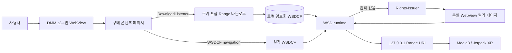

# XR Stream App DMM/WSD 이식 보고서

> 분석일: 2026-08-30
>
> 보고서 유형: APK/DEX/SO 역공학 및 Jetpack XR 이식 (`flavor = null`)
>
> 검증 수준: 오프라인 정적 분석과 소스 정적 검증. Android 빌드, DMM 운영 서버 호출, 물리 헤드셋 재생은 수행하지 않음.

## 1. 실행 요약

DMM VR Player에서 WSD 권리 확인과 loopback 재생 경계를 식별하고, 이를 Jetpack XR 앱의 기존 Media3 플레이어에 연결했다. 최초 구현에 포함했던 원 앱의 OAuth/JWT/SessionID/Digital API 복제 경로는 제거했다. 현재 구현은 DMM 웹 페이지에서 사용자가 직접 로그인하고, WebView가 사이트의 WSDCF 스트림 또는 다운로드를 앱에 넘기는 더 작은 경로를 사용한다. 다운로드 요청에는 WebView 쿠키, User-Agent, Referer를 전달하며 암호화된 파일을 기기 앱 전용 저장소에 보관한다. WSD DEX와 ARM64 SO는 Git 추적 대상으로 바꿔 새 PC의 clone만으로 소스 입력이 완결되도록 했다. 다만 DMM 웹 로그인, 사이트의 실제 다운로드 전달 방식, 일반 웹 세션으로 새 패키지의 WSD 권리 발급이 가능한지는 물리 기기 검증 전까지 미확정이다.

## 2. 범위와 권한

- case: `xr-stream-app-dmm-port`
- 로컬 범위 계약: [scope.md](../../reverse-skill/work/xr-stream-app-dmm-port/scope.md)
- `auth.status`: `granted` (`own_system`)
- `network_profile`: `lab_only`
- in scope: 사용자가 보유한 DMM APK, 공개 테스트 WSDCF, `xr-stream-app`
- out of scope: 계정정보 수집, DRM 우회, 콘텐츠 키 추출, 운영망 자동 테스트

사용자 계정이나 토큰을 저장소에 추가하지 않았고 DMM 운영 서버에는 자동 요청을 보내지 않았다.

## 3. 대상과 런타임 식별

| 대상 | 유형 | SHA-256 | 정적 결과 |
|---|---|---|---|
| `app/src/main/assets/dmm/wsd-runtime.dex` | Dalvik DEX | `f98be3318228f001f29664ac7d8c6dd6cfea6b3229a7a8639b974a9a384ab201` | `WsdVideoInteraction`, `WsdRightsAcquiringSession` 정의 포함 |
| `app/src/main/jniLibs/arm64-v8a/libwsdnat.so` | AArch64 ELF shared object | `6c22660e076bbf7289c303e2a2fda45c1ac9cdc640f08712253e19db35af581a` | WSD 네이티브 계층 |
| `app/src/main/jniLibs/arm64-v8a/libwsdprtn.so` | AArch64 ELF shared object | `2e84f2dcdc25f865a974dbbb97a66f11e307f7d4c026122f95884e1de46660ca` | WSD 보호 계층 |

두 SO의 정적 동적 의존성은 Android 시스템 라이브러리 범위였다. 앱은 WSD DEX가 사용하는 Apache HTTP 호환 클래스를 위해 `org.apache.http.legacy`를 선언한다.

## 4. 구현 변경

| 경계 | 현재 구현 | 이전 구현에서 제거한 것 |
|---|---|---|
| 로그인 | 일반 DMM 구매 목록 WebView, Android CookieManager 세션 | 앱 내 OAuth code/token 교환, JWT 검증, refresh token 저장 |
| 콘텐츠 선택 | 사이트 자체 구매 페이지와 stream/download 동작 | `/purchase/list/vr` 네이티브 구매 목록 API |
| URL 발급 | 사이트가 WebView에 제공한 URL을 수신 | playable-provider HMAC 호출과 URL 조립 |
| 다운로드 | WebView Cookie/User-Agent/Referer를 전달하는 Range 다운로드 | API용 app name/version/auth secret |
| 권리 | WSD Rights-Issuer와 같은 WebView 세션 사용 시도 | `issueSessionId` 호출과 `dmm_app_uid`/`secid` 수동 주입 |
| 재생 | WSD loopback URI → `PlaybackSource.Direct` → Media3 | Unity 의존성 |
| 배포 입력 | DEX/SO Git 추적 | 다른 PC에서 원본 APK 재프로비저닝 요구 |

이 변경은 `dmm_app_uid`가 불필요하다고 입증한 것이 아니다. 우선 정상 웹 세션만으로 가능한 최소 경로를 구현했으며, 권리 서버가 원 앱 전용 값이나 패키지 등록을 실제로 요구하는지는 기기에서 확인해야 한다.

## 5. 호출 및 데이터 흐름



실선은 코드에 연결된 경로를 뜻한다. 각 외부 DMM 단계의 실제 허용 여부는 이 보고서의 정적 검증 범위를 벗어난다.

## 6. Evidence

### E-001 — WSD loopback 경계

- `source_ref`: 원 APK WSD DEX 정적 분석, `DmmWsdRuntime.kt`
- `content_hash`: 런타임 DEX는 E-006/E-008의 SHA-256 참조
- `repro_command`:

  ```bash
  cd ../reverse-skill
  rg -n 'DcfHttpServer|onRightsChecked|requestFirst|requestNext' work/dmm-vr-player/evidence work/dmm-vr-player/report
  cd ../xr-stream-app
  rg -n 'onAcquireRights|onRightsChecked|PlaybackSource.Direct' app/src/main/java
  ```

- 관찰: WSD callback이 권리 필요 여부와 loopback 재생 URI를 분리하며, target 앱은 후자를 Direct playback source로 전달한다.

### E-002 — 원 앱의 SessionID 경계

- `source_ref`: 원 APK의 인증 SDK 정적 분석
- `content_hash`: n/a; 사용자 제공 APK case evidence에 보관
- `repro_command`:

  ```bash
  cd ../reverse-skill
  rg -n 'issueSessionId|unique_id|secure_id|dmm_app_uid|secid' work/dmm-vr-player/evidence/E-016.md work/dmm-vr-player/evidence/E-017.md
  ```

- 관찰: 원 앱 네이티브 경로는 SessionID 응답을 권리 페이지 쿠키로 연결했다. 이것은 현재 web-only 경로가 기기에서 실패할 때 비교할 기준이며, 현재 코드가 해당 값을 생성한다는 뜻은 아니다.

### E-003 — 원 앱의 구매/URL API 경계

- `source_ref`: IL2CPP metadata/method map 및 원 APK 정적 분석
- `content_hash`: n/a; case artifact에 보관
- `repro_command`:

  ```bash
  cd ../reverse-skill
  rg -n 'purchase/list/vr|playableprovider/(stream|download)/vr' work/xr-stream-app-dmm-port/artifacts/dmm-api-static-summary.txt
  ```

- 관찰: 원 네이티브 앱은 구매 목록과 WSDCF URL 발급에 별도 API를 썼다. 현재 구현은 이 경로와 관련 비밀 설정을 모두 제거했다.

### E-007 — WebView 세션 기반 구현

- `source_ref`: `DmmRepository.kt`, `DmmPanel.kt`, `app/build.gradle.kts`
- `content_hash`: n/a; Git commit으로 고정
- `repro_command`:

  ```bash
  rg -n 'CookieManager|getCookie|setAcceptThirdPartyCookies|DownloadListener|startRights|PlaybackSource.Direct' app/src/main/java
  rg -n 'DMM_CLIENT|DMM_JWT|DMM_DIGITAL_API|issueSessionId|playableprovider' app secrets.local.properties.example
  ```

- 관찰: 앱 비밀 설정과 네이티브 API 클라이언트는 없고, WebView 세션·다운로드·WSD 권리·Media3 연결만 남는다.

### E-008 — Git에 포함된 WSD 런타임

- `source_ref`: 저장소의 DEX/SO 세 파일
- `content_hash`: §3 표 참조
- `repro_command`:

  ```bash
  git ls-files app/src/main/assets/dmm/wsd-runtime.dex app/src/main/jniLibs/arm64-v8a/libwsdnat.so app/src/main/jniLibs/arm64-v8a/libwsdprtn.so
  sha256sum app/src/main/assets/dmm/wsd-runtime.dex app/src/main/jniLibs/arm64-v8a/libwsd*.so
  file app/src/main/assets/dmm/wsd-runtime.dex app/src/main/jniLibs/arm64-v8a/libwsd*.so
  ```

- 관찰: 세 런타임 파일이 저장소 입력으로 포함되고 ARM64/DEX 형식과 해시를 정적으로 확인했다.

## 7. Findings

### F-001 — WSD에서 Media3로의 브리지는 정적으로 연결됨

- `severity`: `n/a_re`
- `category`: `reverse_algo`
- `status`: `candidate`
- `evidence_ids`: `[E-001, E-007]`
- `confidence`: high
- `location`: `DmmWsdRuntime -> PlaybackSource.Direct -> VideoPlayerViewModel`
- `impact`: 정상 권리 확인 뒤 WSD loopback 스트림을 Unity 없이 Jetpack XR 플레이어에 전달할 수 있다.
- `residual risk`: 실제 재생, seek, lifecycle은 물리 기기 검증이 필요하다.

### F-002 — 빌드 시 DMM 계정/API 비밀은 필요하지 않음

- `severity`: `info`
- `category`: `design`
- `status`: `validated`
- `evidence_ids`: `[E-003, E-007]`
- `confidence`: high
- `location`: `app/build.gradle.kts`, `secrets.local.properties.example`, `dmm/`
- `impact`: 계정과 토큰을 properties 또는 Git에 넣지 않고 기기 WebView에서 로그인할 수 있는 구조다.
- `residual risk`: 웹 로그인이 DMM 정책상 동작하는지는 별도 문제다.

### F-003 — 다른 PC에서 원본 APK 재프로비저닝은 빌드 입력상 불필요함

- `severity`: `info`
- `category`: `design`
- `status`: `validated`
- `evidence_ids`: `[E-006, E-008]`
- `confidence`: high
- `location`: `app/src/main/assets/dmm`, `app/src/main/jniLibs/arm64-v8a`
- `impact`: 저장소 clone에 DEX/SO가 포함되어 Android Studio가 동일 입력으로 패키징할 수 있다.
- `residual risk`: 실제 Android 패키징 성공은 프로젝트 정책상 실행하지 않았다.

### F-004 — 웹 세션만으로 WSD 권리 발급이 되는지는 미확정

- `severity`: `info`
- `category`: `design`
- `status`: `candidate`
- `evidence_ids`: `[E-002, E-007]`
- `confidence`: medium
- `location`: `DmmRepository.runtimeListener`, DMM Rights-Issuer 서버 정책
- `impact`: 실패하면 원 앱 전용 SessionID/`dmm_app_uid`, 등록 패키지 또는 앱 브리지가 실제 필수 조건일 수 있다.
- `remediation`: 사용자 물리 기기에서 정상 로그인 후 권리 페이지 응답을 확인한다.

### F-005 — 사이트 다운로드/스트리밍 전달 방식은 미확정

- `severity`: `info`
- `category`: `design`
- `status`: `candidate`
- `evidence_ids`: `[E-007]`
- `confidence`: medium
- `location`: `DmmPanel` WebView callbacks
- `impact`: 사이트가 `blob:` 또는 전용 네이티브 브리지를 쓰면 현재 `DownloadListener`/navigation interception으로 URL을 얻지 못한다.
- `remediation`: 헤드셋에서 이벤트 로그를 확인하고, 실패한 단계에만 WebView request/blob bridge 또는 인증 프록시를 추가한다.

## 8. Path

### P-001 — 웹 로그인에서 XR 재생까지

- `path_type`: `callflow`
- `start`: DMMPanel의 사용자 로그인
- `goal`: 구매한 WSDCF를 기존 XR Media3 플레이어에서 재생
- `steps`:
  1. 사용자가 일반 DMM WebView에서 로그인한다. — evidence: E-007 — finding: F-002
  2. 사이트의 stream/download 동작에서 WSDCF URL을 받는다. — evidence: E-007 — finding: F-005
  3. 다운로드라면 WebView 요청 문맥으로 암호화 파일을 앱 전용 저장소에 저장하고, 스트림이면 원격 URI를 WSD에 전달한다. — evidence: E-007 — finding: F-005
  4. WSD가 권리를 확인하고 필요하면 같은 WebView에 Rights-Issuer 페이지를 연다. — evidence: E-001, E-007 — finding: F-004
  5. 권리가 승인되면 WSD loopback URI를 Media3에 전달한다. — evidence: E-001, E-007 — finding: F-001
- `residual_risks`: 1, 2, 4, 5단계의 외부/기기 동작은 물리 헤드셋에서 검증되지 않았다.

## 9. 정적 검증과 동적 분석 제한

수행한 검증:

```bash
git diff --check
bash -n scripts/provision-dmm-runtime.sh
sha256sum app/src/main/assets/dmm/wsd-runtime.dex app/src/main/jniLibs/arm64-v8a/libwsd*.so
file app/src/main/assets/dmm/wsd-runtime.dex app/src/main/jniLibs/arm64-v8a/libwsd*.so
rg -n 'DMM_CLIENT|DMM_JWT|DMM_DIGITAL_API|issueSessionId|playableprovider' app secrets.local.properties.example
```

Android 빌드, 리소스 컴파일, 단위 테스트, 설치, ADB 동적 검증은 `AGENTS.md`의 Codex CLI 빌드 금지 규칙 때문에 수행하지 않았다. DMM 운영 서버 테스트도 case의 `lab_only` 및 `production_network_testing` 제외 범위 때문에 수행하지 않았다.

## 10. Timeline 요약

| 시각(KST) | 단계 | 결과 |
|---|---|---|
| 2026-08-30 20:36 | scope 초기화 | 사용자 소유 샘플과 앱을 범위로 설정 |
| 2026-08-30 21:42 | 원 APK 정적 분석 | WSD, SessionID, native API 경계를 식별 |
| 2026-08-30 21:53 | 최초 포트 정적 검증 | Media3/WSD 연결 확인, 기기 검증은 보류 |
| 2026-08-30 후속 수정 | web-only 재설계 | OAuth/API 비밀 경로 제거, DEX/SO Git 포함, 기기 체크리스트 작성 |

## 11. 다음 검증

실제 기기에서 로그인 → 구매 페이지 → 다운로드 → 권리 발급 → 오프라인 재생 순으로 먼저 확인한다. 각 단계의 `DmmWebFlow` 이벤트에 따라 실패 지점을 좁힌다. 전체 체크리스트와 해석 기준은 [DMM WebView 인계 문서](./DMM_WEBVIEW_HANDOFF.md)에 있다.
