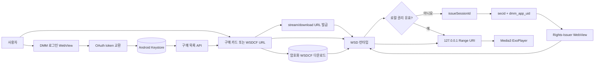

# DMM/FANZA 재생 사용법

> 이 통합은 DRM을 제거하지 않습니다. DMM 계정 로그인, 구매 권한 확인, WSD 라이선스 발급이 모두 성공한 콘텐츠만 재생합니다. DMM이 이 앱의 OAuth client/redirect와 패키지를 허용해야 하며, 이 서버 정책은 오프라인 분석만으로 보장할 수 없습니다.

## 빠른 설정

1. 보유한 DMM Android APK에서 WSD 런타임을 로컬 프로젝트에 설치합니다.

   ```bash
   scripts/provision-dmm-runtime.sh \
     /path/to/base.apk \
     /path/to/split_config.arm64_v8a.apk
   ```

   스크립트는 WSD가 들어 있는 DEX를 자동 탐지하고 `libwsdnat.so`, `libwsdprtn.so`를 설치합니다. 이 세 파일은 Git에서 제외됩니다.

2. 로컬 시크릿 파일을 만듭니다.

   ```bash
   cp secrets.local.properties.example secrets.local.properties
   ```

3. DMM이 이 앱에 사용하도록 허가한 값을 `secrets.local.properties`에 입력합니다.

   ```properties
   DMM_CLIENT_ID=<issued client id>
   DMM_CLIENT_SECRET=<issued client secret>
   DMM_REDIRECT_URI=<registered redirect URI>
   DMM_JWT_SECRET=<issued ID-token verification key>
   DMM_LIBRARY_URL=https://www.dmm.co.jp/digital/videoa/-/mylibrary/
   DMM_DIGITAL_API_BASE_URL=https://vr.digapi.dmm.com
   DMM_DIGITAL_API_AUTH_SECRET=<authorized playable-provider signing key>
   DMM_EXPLOIT_ID_PREFIX=uid:
   DMM_APP_NAME=<registered Digital API app name>
   DMM_API_APP_VERSION=<registered API client version>
   DMM_DEFAULT_DOWNLOAD_QUALITY=high
   ```

   원 APK에 내장된 client secret을 저장소에 복사하거나 커밋하지 마십시오. 사용자 비밀번호와 JWT를 개발자에게 전달할 필요도 없습니다.

4. 개발 환경에서 앱을 빌드한 뒤 왼쪽 소스 목록의 **DMM / FANZA**를 엽니다.

## 로그인하고 스트리밍하기

1. **Sign in to DMM**을 선택합니다.
2. DMM WebView에서 직접 로그인합니다. 비밀번호는 앱 코드가 읽거나 저장하지 않습니다.
3. OAuth redirect가 돌아오면 앱이 access/refresh/ID token을 교환하고 Android Keystore로 암호화합니다.
4. 로그인 직후 앱이 DMM Digital API의 `/purchase/list/vr`로 구매 목록을 읽습니다.
5. 구매 카드의 **Stream**을 누르면 `/playableprovider/stream/vr`이 현재 계정용 redirect와 `cookie_info.value`를 발급합니다. 앱은 원 클라이언트와 같이 `&licenseUID=<value>&smartphone_access=1`을 붙여 WSD에 전달합니다.
6. **Download**는 `/playableprovider/download/vr`을 호출하고 원 클라이언트와 같이 `?uid=<cookie_info.value>`를 redirect에 붙여 암호화 파일을 받습니다.
7. 앱은 해당 요청을 원 앱과 같은 헤더와 HMAC-SHA256 파라미터 순서로 서명합니다. `x-exploit-id`는 원 클라이언트와 같이 `uid:<user_id>`로 만듭니다. 서명 키와 client 식별자는 이 앱에 허가된 로컬 설정값만 사용합니다.
8. 직접 받은 WSDCF URL이 있다면 위쪽 URL 입력란도 계속 사용할 수 있습니다.
9. 로컬 권리가 없으면 앱이 `issueSessionId`를 호출하고 `secid`와 `dmm_app_uid`를 권리 페이지 쿠키로 설정합니다.
10. 라이선스가 승인되면 WSD가 `127.0.0.1` Range URI를 만들고 기존 Media3/ExoPlayer 화면이 재생합니다.

`DMM_DIGITAL_API_AUTH_SECRET`이 비어 있으면 웹 로그인과 구매 목록 조회까지만 가능하며, 구매 카드의 URL 발급은 명시적인 설정 오류로 중단됩니다. 원 APK에 들어 있는 서명 키를 자동 추출하거나 복사하지 않습니다.

## 다운로드와 오프라인 재생

- URL을 입력한 뒤 **Download**를 선택하면 암호화된 WSDCF가 앱 내부 저장소에 저장됩니다. 중단된 HTTP 다운로드는 Range 요청으로 이어받습니다.
- 기기에 이미 있는 공개 테스트 파일은 **Import file**로 가져옵니다.
- **Offline downloads**에서 **Play offline**을 선택합니다.
- 오프라인 재생도 기존에 이 기기와 앱 패키지에 저장된 유효한 WSD 권리가 있어야 합니다. 권리가 없거나 만료되면 네트워크 연결 후 정상 라이선스 절차가 필요합니다.

## 동작 구조



## 오류 확인

| 메시지 | 의미와 조치 |
|---|---|
| OAuth is not configured | 네 개의 `DMM_*` 인증 설정이 비어 있습니다. DMM에 등록된 값을 로컬 시크릿에 입력합니다. |
| WSD runtime is missing | 프로비저닝 스크립트를 실행하고 ARM64 split APK에 두 네이티브 라이브러리가 있는지 확인합니다. |
| Sign in before acquiring rights | 먼저 DMM 로그인을 완료합니다. |
| ID-token signature verification failed | JWT 검증 키가 이 OAuth client와 맞지 않습니다. 토큰을 수동으로 붙여넣지 말고 설정을 확인합니다. |
| DMM Digital API is not configured | 구매 목록에 필요한 Digital API app name/version/base URL 설정을 확인합니다. |
| DMM playable-provider signing is not configured | 이 앱에 사용하도록 허가된 `DMM_DIGITAL_API_AUTH_SECRET`을 로컬 시크릿에 설정합니다. |
| DMM/WSD did not return a rights page | 서버가 요청을 거절했거나 OAuth client/package 정책이 맞지 않을 수 있습니다. |

## 보안 경계

- 사용자 비밀번호를 앱 API나 설정 파일로 받지 않습니다.
- 토큰과 SessionID는 Android Keystore AES-GCM으로 암호화합니다.
- cleartext HTTP는 WSD의 `127.0.0.1`/`localhost`에만 허용합니다.
- 다운로드 파일은 암호화 상태로 보관하며 콘텐츠 키를 내보내지 않습니다.
- 라이선스 실패, 만료, HDMI 제한 등 WSD 오류를 우회하지 않습니다.
