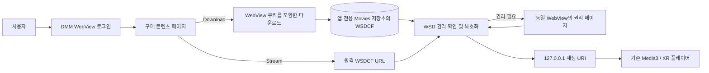

# DMM/FANZA 재생 사용법

> 현재 구현은 DMM 웹 로그인 세션을 그대로 사용하는 실험 경로입니다. DRM을 제거하거나 권리 검사를 우회하지 않습니다. 로그인, 다운로드 URL 전달, WSD 권리 발급이 이 앱 패키지에서도 허용되는지는 실제 Android XR 기기에서 확인해야 합니다.

## 바로 사용하기

1. 저장소를 새로 clone한 뒤 Android Studio에서 앱을 빌드하고 헤드셋에 설치합니다.
2. 왼쪽 소스 목록에서 **DMM / FANZA**를 엽니다.
3. 패널 안의 DMM 웹 페이지에서 직접 로그인합니다.
4. 구매 목록으로 이동해 사이트가 제공하는 **Stream** 또는 **Download** 동작을 선택합니다.
5. 다운로드가 완료되면 **Offline downloads** 카드에서 재생합니다.
6. WSD 권리 페이지가 열리면 같은 WebView 안에서 정상 인증 절차를 마칩니다.

앱에 계정, 비밀번호, JWT, OAuth client secret을 입력하는 설정은 없습니다. 로그인 정보는 Android WebView 쿠키 저장소 안에만 머뭅니다.

## 빌드 준비

WSD 런타임은 다음 경로에 저장소 파일로 포함되어 있으므로 다른 PC에서 원본 DMM APK를 다시 프로비저닝할 필요가 없습니다.

| 파일 | 용도 |
|---|---|
| `app/src/main/assets/dmm/wsd-runtime.dex` | WSD Java/Dalvik 런타임 |
| `app/src/main/jniLibs/arm64-v8a/libwsdnat.so` | ARM64 WSD 네이티브 런타임 |
| `app/src/main/jniLibs/arm64-v8a/libwsdprtn.so` | ARM64 WSD 보호 런타임 |

`scripts/provision-dmm-runtime.sh`는 위 세 파일을 사용자가 보유한 APK에서 의도적으로 갱신할 때만 쓰는 유지보수 도구입니다. 일반 빌드 단계에는 필요하지 않습니다.

프로젝트 정책상 Codex CLI에서는 Gradle 빌드나 테스트를 실행하지 않았습니다. Android Studio 빌드는 사용자의 Android 개발 환경에서 수행해야 합니다.

## 동작 방식



- **로그인**: 앱 자체 OAuth 구현이 아니라 일반 DMM 웹 페이지를 사용합니다.
- **다운로드**: WebView가 전달한 WSDCF 다운로드를 앱 전용 저장소에 암호화된 상태로 저장하며 HTTP Range 재개를 지원합니다.
- **스트리밍**: 사이트가 노출한 WSDCF URL을 WSD에 전달합니다.
- **권리 확인**: 로컬 권리가 없으면 WSD Rights-Issuer 흐름을 시작하고 권리 페이지를 기존 WebView에 엽니다.
- **재생**: 권리 확인 뒤 WSD가 반환한 loopback URI를 `PlaybackSource.Direct`로 기존 Media3 플레이어에 연결합니다.

## 오프라인 파일 위치와 수명

다운로드 파일은 우선 다음 앱 전용 외부 저장소 아래에 저장됩니다.

```text
Android/data/blackark.app.vr/files/Movies/dmm-downloads/
```

기기에서 외부 앱 전용 저장소를 제공하지 않으면 앱 내부 `files/dmm-downloads`로 대체됩니다. 앱을 삭제하면 앱 전용 다운로드와 WSD가 저장한 권리도 함께 사라질 수 있습니다.

오프라인 WSDCF 자체는 암호화된 파일입니다. 재생하려면 이 설치본에 유효한 WSD 권리가 있어야 하며, 권리가 없거나 만료되면 네트워크에 연결해 정상 권리 발급 절차를 다시 거쳐야 합니다.

## 수동 URL과 파일 가져오기

- 사이트 동작을 앱이 자동으로 잡지 못할 때, 정상적으로 발급받은 `.wsdcf` URL을 입력해 **Stream** 또는 **Download**를 선택할 수 있습니다.
- 이미 기기에 있는 공개 테스트 WSDCF는 **Import file**로 앱 전용 저장소에 복사할 수 있습니다.
- 공개 파일이라는 사실은 재생 권리가 공개라는 뜻이 아닙니다. WSD의 정상 권리 확인은 그대로 실행됩니다.

## 물리 기기에서 확인하기

다음 로그는 URL의 query와 fragment, 쿠키, 토큰을 출력하지 않도록 제한되어 있습니다.

```bash
adb logcat -s DmmWebFlow
```

정상 경로에서 볼 수 있는 주요 이벤트는 다음과 같습니다.

| 이벤트 | 의미 |
|---|---|
| `web_login_open` | 로그인용 구매 목록 페이지를 열었음 |
| `web_page_finished ... sessionDetected=true` | 알려진 DMM 세션 쿠키를 감지했음. 재생 승인 자체를 뜻하지는 않음 |
| `download_intercepted` | WebView의 WSDCF 다운로드를 앱이 인수했음 |
| `download_complete` | 암호화 파일 저장 완료 |
| `stream_link_intercepted` | WSDCF 탐색을 스트리밍으로 인수했음 |
| `rights_required` | 로컬 권리가 없어 Rights-Issuer 절차가 필요함 |
| `rights_response` | WSD 권리 요청 응답 수신 |
| `wsd_ready` | WSD가 Media3용 loopback URI를 반환함 |
| `flow_error` | 실패 유형을 민감값 없이 기록함 |

## 현재 제한과 실패 해석

| 증상 | 해석 및 다음 확인 |
|---|---|
| WebView 로그인이 완료되지 않음 | DMM이 임베디드 WebView를 허용하는지, 보안 인증 또는 리디렉션이 막히는지 기기에서 확인합니다. |
| 로그인은 되지만 `download_intercepted`가 없음 | 사이트가 `DownloadListener`가 아닌 JavaScript `blob:` 또는 별도 앱 브리지로 다운로드할 가능성이 있습니다. WebView 요청 관찰 로직이 추가로 필요합니다. |
| 다운로드 HTTP 401/403 | CDN 리디렉션 뒤에도 Cookie/User-Agent/Referer가 충분한지 확인해야 합니다. |
| 스트리밍만 401/403 | 원격 WSDCF가 WebView 쿠키를 요구하지만 WSD 내부 HTTP 클라이언트가 공유하지 못할 수 있습니다. 인증된 로컬 Range 프록시가 추가로 필요할 수 있습니다. |
| 권리 페이지 또는 라이선스가 거절됨 | 일반 웹 세션만으로 새 패키지의 WSD 권리 발급이 가능한지 확인하는 핵심 실패 지점입니다. 이 경우 `dmm_app_uid` 또는 원 앱 전용 브리지/패키지 정책이 실제 제약일 수 있습니다. |
| `wsd_ready` 뒤 재생 실패 | WSD loopback URI의 Range 응답과 Media3 연결, seek 동작을 기기 로그로 확인합니다. |

상세 변경 내역과 검증 체크리스트는 [DMM WebView 인계 문서](./DMM_WEBVIEW_HANDOFF.md)에 정리되어 있습니다.

## 보안 및 권리 경계

- 실제 계정, 비밀번호, JWT, 쿠키, 토큰을 Git이나 properties 파일에 넣지 않습니다.
- URL query/fragment에는 임시 라이선스 값이 들어갈 수 있으므로 로그나 이슈에 그대로 붙이지 않습니다.
- WSD DEX/SO는 권리 확인과 복호화를 담당하며 실패·만료·출력 제한을 우회하지 않습니다.
- 포함된 런타임의 보관·배포 권한은 저장소 소유자가 별도로 확인해야 합니다.
